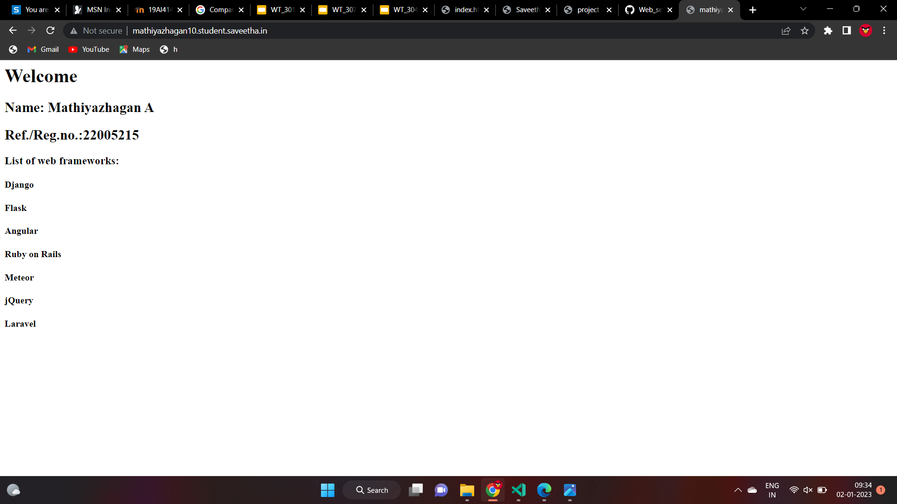

# Developing a Simple Webserver

# AIM:

Name: Mathiyazhagan
reg.no:22005215

# DESIGN STEPS:

## Step 1:

HTML content creation is done

## Step 2:

Design of webserver workflow

## Step 3:

Implementation using Python code

## Step 4:

Serving the HTML pages.

## Step 5:

Testing the webserver

# PROGRAM:
```
from http.server import HTTPServer, BaseHTTPRequestHandler

content = """
<html>
<head>
</head>
<body>
<h1>Welcome</h1>
<h2>Name: Mathiyazhagan A</h2>
<h2>Ref./Reg.no.:22005215</h2>
<h3>List of web frameworks:</h3>
<h4>Django</h4>
<h4>Flask</h4>
<h4>Angular</h4>
<h4>Ruby on Rails</h4>
<h4>Meteor</h4>
<h4>jQuery</h4>
<h4>Laravel</h4>
</body>
</html>
"""

class HelloHandler (BaseHTTPRequestHandler):
    def do_GET(self):
        self.send_response(200)
        self.send_header('content-type','text/html;charset=utf-8')
        self.end_headers()
        self.wfile.write(content.encode())

server_address=('',80)
httpd=HTTPServer(server_address,HelloHandler)
httpd.serve_forever()
```
# OUTPUT:




# RESULT:

The program is executed succesfully
